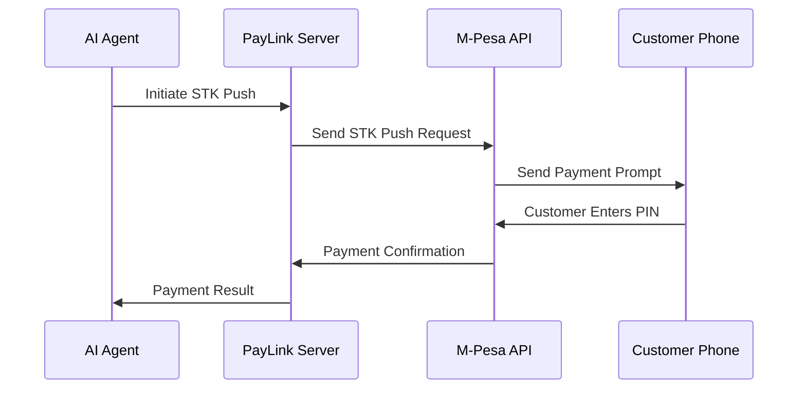

<div align="center">
  <picture>
    
  </picture>
</div>

<h1 align="center">PayLink - AI-Powered Payment Integration Framework</h1>
<p align="center"><strong>💳 MCP Payment Servers | 🚀 Instant Payment Processing | 🔐 Secure Authentication</strong></p>

<div align="center">

[](https://paylink.mintlify.app/)
[](https://paylink.mintlify.app/)
[](LICENSE)
[](https://python.org)
[](https://modelcontextprotocol.io)

</div>

## 🚀 What is PayLink?

PayLink is an open-source framework designed to simplify payment integrations for AI agents by leveraging the Model Context Protocol (MCP). It provides a standardized interface for various payment providers, including **M-Pesa**, **Airtel**, **Equity Bank**, and **KCB**, enabling seamless integration of payment functionalities into your AI applications.

### ✨ Key Features

- **💳 Multi-Provider Support**: M-Pesa, Airtel Money, Equity Bank, KCB
- **🤖 AI-First Design**: Built specifically for AI agents and MCP integration
- **🔐 Secure Authentication**: Enterprise-grade security with OAuth support
- **🚀 Instant Setup**: Get payment processing running in minutes
- **📱 Mobile-First**: Optimized for mobile payment workflows
- **🌍 East Africa Focus**: Specialized for regional payment systems

## 🏗️ Architecture Overview

The PayLink ecosystem consists of three main components:

1. **PayLink MCP Servers**: Host payment tools and connect to payment providers
2. **PayLink SDK**: Client libraries for connecting to the server
3. **Payment Providers**: External services like M-Pesa, Airtel, etc.

```
┌─────────────────┐    ┌─────────────────┐    ┌─────────────────┐
│   AI Agent     │    │  PayLink MCP    │    │   Payment      │
│   (Claude,     │◄──►│     Server      │◄──►│   Providers    │
│   GPT, etc.)   │    │                 │    │  (M-Pesa, etc.)│
└─────────────────┘    └─────────────────┘    └─────────────────┘
```

## 🚀 Quick Start - Get Payment Processing in 5 Minutes

### 🌐 Using PayLink Hosted Service (Recommended)

Get instant access to payment processing with our managed infrastructure:

```bash
pip install paylink
```

```python
from paylink import PayLink

# Initialize with your API key
paylink = PayLink(api_key="your-api-key")

# Create M-Pesa server instance
mpesa_server = paylink.create_server("mpesa", {
    "business_shortcode": "your_shortcode",
    "consumer_key": "your_consumer_key",
    "consumer_secret": "your_consumer_secret"
})

# Initiate payment
result = await mpesa_server.stk_push(
    amount="100",
    phone_number="254797357665",
    account_reference="PAYMENT001",
    transaction_desc="Payment for services"
)
```

### 🐳 Self-Hosting with Docker

```bash
# Clone the repository
git clone https://github.com/your-org/paylink.git
cd paylink

# Run M-Pesa server
cd mcp_servers/mpesa
docker build -t paylink-mpesa .
docker run -p 5002:5002 paylink-mpesa

# Run Airtel server
cd ../airtel
docker build -t paylink-airtel .
docker run -p 5003:5003 paylink-airtel
```

### 🖥️ Direct Setup

```bash
# Install dependencies
cd mcp_servers/mpesa
pip install -r requirements.txt

# Set environment variables
export MPESA_CONSUMER_KEY="your_consumer_key"
export MPESA_CONSUMER_SECRET="your_consumer_secret"
export MPESA_BUSINESS_SHORT_CODE="your_shortcode"
export MPESA_PASSKEY="your_passkey"
export MPESA_CALLBACK_URL="https://yourdomain.com/callback"

# Run the server
python server.py
```

## 💳 Available Payment Providers

| Provider | Status | Features | Docker Image |
|----------|--------|----------|--------------|
| **M-Pesa** | ✅ Production Ready | STK Push, C2B, B2C | `paylink-mpesa:latest` |
| **Airtel Money** | 🚧 In Development | STK Push, USSD | `paylink-airtel:latest` |
| **Equity Bank** | 🚧 In Development | Bank Transfers | `paylink-equity:latest` |
| **KCB** | 🚧 In Development | Bank Transfers | `paylink-kcb:latest` |

## 🔧 M-Pesa Integration

### STK Push (Express Payment)

The most popular payment method - sends a payment prompt directly to the customer's phone:

```python
from paylink import PayLink

paylink = PayLink()
mpesa = paylink.create_server("mpesa")

# Initiate STK Push
result = await mpesa.stk_push(
    amount="100",                    # Amount in KES
    phone_number="254797357665",     # Customer phone (254 format)
    account_reference="ORDER123",    # Your reference
    transaction_desc="Payment"       # Description for customer
)

print(f"Payment initiated: {result['checkout_request_id']}")
```

### C2B (Customer to Business)

For receiving payments from customers:

```python
# Register C2B URL
await mpesa.c2b_register_url(
    shortcode="your_shortcode",
    response_type="Completed",
    confirmation_url="https://yourdomain.com/confirm",
    validation_url="https://yourdomain.com/validate"
)
```

### B2C (Business to Customer)

For sending money to customers:

```python
# Send money to customer
result = await mpesa.b2c(
    amount="500",
    phone_number="254797357665",
    command_id="BusinessPayment",
    remarks="Salary payment"
)
```

## 🔐 Authentication & Security

### Environment Configuration

Create a `.env` file with your payment provider credentials:

```bash
# M-Pesa Configuration
MPESA_CONSUMER_KEY=your_consumer_key_here
MPESA_CONSUMER_SECRET=your_consumer_secret_here
MPESA_BUSINESS_SHORT_CODE=your_shortcode
MPESA_PASSKEY=your_passkey_here
MPESA_CALLBACK_URL=https://yourdomain.com/callback
MPESA_ENVIRONMENT=sandbox  # or production

# Airtel Configuration
AIRTEL_CLIENT_ID=your_client_id
AIRTEL_CLIENT_SECRET=your_client_secret
AIRTEL_MERCHANT_ID=your_merchant_id

# Server Configuration
MPESA_MCP_SERVER_PORT=5002
AIRTEL_MCP_SERVER_PORT=5003
```

### OAuth Support

For services requiring OAuth authentication:

```python
# Initialize with OAuth
paylink = PayLink(
    api_key="your_api_key",
    oauth_config={
        "client_id": "your_oauth_client_id",
        "client_secret": "your_oauth_client_secret",
        "redirect_uri": "https://yourdomain.com/oauth/callback"
    }
)
```

## 🛠️ MCP Server Configuration

### Cursor/VS Code Integration

Add to your MCP configuration:

```json
{
  "mcpServers": {
    "paylink-mpesa": {
      "command": "python",
      "args": ["-m", "mcp_servers.mpesa.server"],
      "env": {
        "MPESA_CONSUMER_KEY": "your_key",
        "MPESA_CONSUMER_SECRET": "your_secret"
      }
    },
    "paylink-airtel": {
      "command": "python", 
      "args": ["-m", "mcp_servers.airtel.server"],
      "env": {
        "AIRTEL_CLIENT_ID": "your_client_id",
        "AIRTEL_CLIENT_SECRET": "your_client_secret"
      }
    }
  }
}
```

### Claude Desktop Integration

```json
{
  "mcpServers": {
    "paylink-mpesa": {
      "command": "docker",
      "args": ["run", "--rm", "-p", "5002:5002", "paylink-mpesa:latest"]
    }
  }
}
```

## 📱 Payment Workflows

### 1. Express Payment (STK Push)



### 2. Payment Verification

```python
# Check payment status
status = await mpesa.check_payment_status(
    checkout_request_id="ws_CO_200820251410556797357665"
)

if status["status"] == "completed":
    print(f"Payment successful: {status['amount']} KES")
else:
    print(f"Payment failed: {status['error_message']}")
```

## 🚀 Advanced Features

### Webhook Handling

Set up webhooks to receive real-time payment notifications:

```python
from fastapi import FastAPI, Request
from paylink import PayLink

app = FastAPI()
paylink = PayLink()

@app.post("/webhook/mpesa")
async def mpesa_webhook(request: Request):
    data = await request.json()
    
    # Verify webhook signature
    if paylink.verify_webhook_signature(data, request.headers):
        # Process payment notification
        await process_payment_notification(data)
        return {"status": "success"}
    
    return {"status": "invalid_signature"}
```

### Batch Processing

Process multiple payments efficiently:

```python
# Batch STK Push
payments = [
    {"amount": "100", "phone": "254797357665", "ref": "PAY001"},
    {"amount": "200", "phone": "254797357666", "ref": "PAY002"},
    {"amount": "150", "phone": "254797357667", "ref": "PAY003"}
]

results = await mpesa.batch_stk_push(payments)
```

### Payment Analytics

Track payment performance and insights:

```python
# Get payment analytics
analytics = await mpesa.get_analytics(
    start_date="2025-01-01",
    end_date="2025-01-31"
)

print(f"Total transactions: {analytics['total_transactions']}")
print(f"Success rate: {analytics['success_rate']}%")
print(f"Total volume: {analytics['total_volume']} KES")
```

## 🔍 Testing & Development

### Sandbox Environment

All payment providers include sandbox environments for testing:

```python
# Use sandbox for development
paylink = PayLink(environment="sandbox")

# Test payment with sandbox credentials
result = await mpesa.stk_push(
    amount="1",  # Test with 1 KES
    phone_number="254797357665",
    account_reference="TEST001",
    transaction_desc="Test Payment"
)
```

### Mock Server

For development without real payment providers:

```python
from paylink.mock import MockPaymentServer

# Create mock server for testing
mock_server = MockPaymentServer()
mock_server.simulate_payment_success = True

# Test your payment logic
result = await mock_server.stk_push(
    amount="100",
    phone_number="254797357665",
    account_reference="TEST001",
    transaction_desc="Test"
)
```

## 📊 Monitoring & Logging

### Structured Logging

```python
import logging

# Configure logging
logging.basicConfig(level=logging.INFO)
logger = logging.getLogger("paylink")

# Log payment events
logger.info("Payment initiated", extra={
    "amount": "100",
    "phone_number": "254797357665",
    "reference": "PAY001",
    "provider": "mpesa"
})
```

### Health Checks

```python
# Check server health
health = await mpesa.health_check()

if health["status"] == "healthy":
    print("M-Pesa server is running")
else:
    print(f"Server issues: {health['issues']}")
```

## 🚀 Deployment

### Docker Compose

```yaml
version: '3.8'
services:
  paylink-mpesa:
    build: ./mcp_servers/mpesa
    ports:
      - "5002:5002"
    environment:
      - MPESA_CONSUMER_KEY=${MPESA_CONSUMER_KEY}
      - MPESA_CONSUMER_SECRET=${MPESA_CONSUMER_SECRET}
      - MPESA_BUSINESS_SHORT_CODE=${MPESA_BUSINESS_SHORT_CODE}
      - MPESA_PASSKEY=${MPESA_PASSKEY}
    volumes:
      - ./logs:/app/logs

  paylink-airtel:
    build: ./mcp_servers/airtel
    ports:
      - "5003:5003"
    environment:
      - AIRTEL_CLIENT_ID=${AIRTEL_CLIENT_ID}
      - AIRTEL_CLIENT_SECRET=${AIRTEL_CLIENT_SECRET}
```

### Kubernetes

```yaml
apiVersion: apps/v1
kind: Deployment
metadata:
  name: paylink-mpesa
spec:
  replicas: 3
  selector:
    matchLabels:
      app: paylink-mpesa
  template:
    metadata:
      labels:
        app: paylink-mpesa
    spec:
      containers:
      - name: paylink-mpesa
        image: paylink-mpesa:latest
        ports:
        - containerPort: 5002
        env:
        - name: MPESA_CONSUMER_KEY
          valueFrom:
            secretKeyRef:
              name: mpesa-secrets
              key: consumer-key
```

## 🤝 Contributing

We welcome contributions! Here's how you can help:

### 🐛 Report Issues

- [Create a new issue](https://github.com/your-org/paylink/issues)
- Include detailed error messages and reproduction steps
- Specify your environment and configuration

### 🔧 Submit Pull Requests

1. Fork the repository
2. Create a feature branch (`git checkout -b feature/amazing-feature`)
3. Commit your changes (`git commit -m 'Add amazing feature'`)
4. Push to the branch (`git push origin feature/amazing-feature`)
5. Open a Pull Request

### 🧪 Testing

```bash
# Run tests
pytest tests/

# Run with coverage
pytest --cov=paylink tests/

# Run linting
flake8 paylink/
black paylink/
```

## 📚 Resources & Documentation

| Resource | Link | Description |
|----------|------|-------------|
| **📖 Documentation** | [paylink.mintlify.app](https://paylink.mintlify.app/) | Complete guides and API reference |
| **🔧 API Reference** | [API Docs](https://paylink.mintlify.app/api-reference) | Detailed endpoint documentation |
| **🚀 Quickstart** | [Quickstart Guide](https://paylink.mintlify.app/quickstart) | Get started in 5 minutes |
| **💡 Examples** | [Examples](https://paylink.mintlify.app/essentials/code) | Working code examples |
| **🐳 Docker Hub** | [Docker Images](https://hub.docker.com/r/paylink) | Official container images |

## 📄 License

This project is licensed under the MIT License - see the [LICENSE](LICENSE) file for details.

## 🙏 Acknowledgments

- **Safaricom M-Pesa** for their comprehensive API
- **Airtel Money** for mobile money integration
- **Equity Bank** and **KCB** for banking partnerships
- **MCP Community** for the Model Context Protocol
- **Open Source Contributors** who make this project possible

---

<div align="center">
  <p><strong>💳 Powering AI-Powered Payments Across East Africa</strong></p>
  <p>
    <a href="https://paylink.mintlify.app/">Documentation</a> •
    <a href="https://paylink.mintlify.app/quickstart">Quickstart</a> •
    <a href="https://paylink.mintlify.app/api-reference">API Reference</a> •
    <a href="https://github.com/your-org/paylink/issues">Issues</a>
  </p>
</div>
